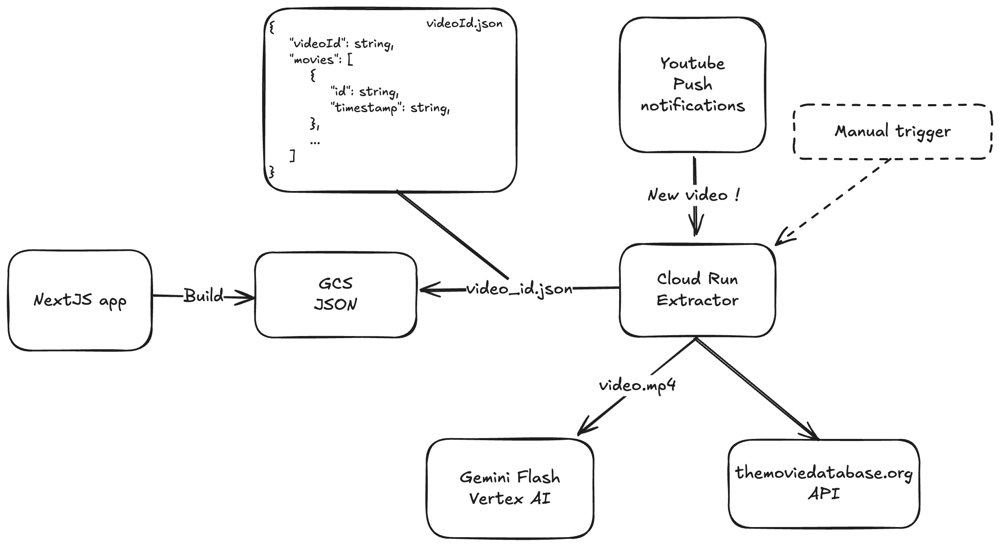

### videoclub-top.net

[videoclub-top.net](https://videoclub-top.net) is a catalogue of all movie references mentioned by directors in Konbini's Youtube video series [Video Club](https://www.konbini.com/playlist/video-club/).

The [extractor](./extractor/) directory contains code to automate the process of extracting movie scenes from videos, and matching these scenes with entries in the [TMDB database](https://www.themoviedb.org/). All extracted data is then uploaded to a GCP bucket.

The [web](./web/) is a NextJS app that connects to the GCP bucket during each build. The website itself is statically hosted on Firebase.

#### Backend

The infrastructure is hosted on Google Cloud.

